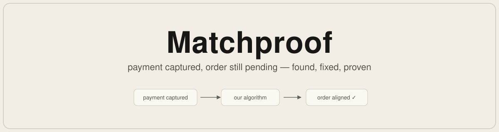

<div align="center">
  

  <a href="https://matchproof.arshjaved.in"><b>Live dashboard</b></a> · running on Razorpay Test Mode

  <a href="https://razorpay.com"></a>
  &nbsp;<a href="https://groq.com"></a>
  &nbsp;
  &nbsp;<a href="https://nextjs.org"></a>
  &nbsp;<a href="https://orm.drizzle.team"></a>
  &nbsp;
  &nbsp;
  &nbsp;
  &nbsp;

  <table>
    <tr>
      <th>&nbsp;37 / 100&nbsp;</th>
      <th>&nbsp;0&nbsp;</th>
      <th>&nbsp;63&nbsp;</th>
      <th>&nbsp;100%&nbsp;</th>
    </tr>
    <tr>
      <td>closed and verified</td>
      <td>wrong fixes</td>
      <td>kept for review with evidence</td>
      <td>match accuracy on matched rows</td>
    </tr>
  </table>
</div>

## The problem

<table>
<tr>
<td width="52%" valign="top">

Matchproof fixes a problem every Razorpay merchant runs into: a payment captures, but the merchant order stays pending. We built our own reconciliation algorithm: it checks multiple things about a payment before it touches an order. On 100 synthetic test records it closed 37 end to end with zero wrong fixes, and kept the other 63 in a review queue with the evidence and a reason attached to each.

Built for the AI Finance Controller track: run one finance-operations loop over a batch of records, report the match rate, and keep every unresolved exception visible.

The numbers come from a labeled test set: 120 synthetic incidents, 20 used while building the system and 100 held back for scoring. The AI's five calls go to the 63 hard rows, not the 37 easy ones.

</td>
<td width="48%" valign="middle">


</td>
</tr>
</table>

## Results

| | Rule-based | With AI |
| --- | ---: | ---: |
| **Closed automatically, verified** | **37 / 100** | **37 / 100** |
| Exceptions kept for review | 63 | 63 |
| **Wrong fixes** | **0** | **0** |
| Match accuracy on rows it could match | 100% | 100% |
| Unsafe writes | 0 | 0 |
| Speed | 16.3 rows/s | 1.4 rows/s |
| Model calls for the batch | 0 | 5 |

The dataset is synthetic and labeled. Reproduce the run with `pnpm evaluate:baseline` and `pnpm evaluate:full`

<details>
<summary><b>The 63 that stay open — and why that is the safe answer</b></summary>

The 37 closures are the rows where Razorpay's API settles the question: a late authorization, a paid-then-pending order, a capture timeout. The 63 below are rows where the deciding fact is not in the provider's API at all.

- 13: Whether the merchant's backend already applied the payment another way. That state lives inside the merchant's system, unreadable by design.
- 13: Whether the merchant processed the payment anyway. Provider data cannot reveal what the merchant already knows.
- 13: Whether the settlement event was never sent, lost, or still queued. The API will not say, and closing the order would assume money that may not have settled.
- 12: Whether the order was updated locally through another flow. Same unreadable merchant-side state.
- 12: Which of the two orders owns the money. That is a merchant business decision, not an API fact.

Every exception stays in the queue with its evidence, a named owner, and why it stopped. Handing those rows to a human is what makes the 37 closures safe to trust. The AI helps here: five model calls cover the whole batch, and the reasoning with facts it writes for each exception tells the operator what is missing and what to check next.

</details>

<details>
<summary><b>Safety</b></summary>

- The system acts only on evidence verified as coming from Razorpay, **cryptographically signed** so nothing forged gets in.
- The only write it can make is aligning the merchant order to verified payment state. Captures, refunds, payouts, fulfilment, and arbitrary writes are blocked and audited.
- The AI is read-only. It suggests based on facts; our algorithm decides.
- Every repair runs under an idempotency key, so a lost acknowledgement cannot apply it twice, and both records are re-read before anything closes.
- Everything lands in an audit log nobody can rewrite. Adversarial tests pass: prompt injection, unsupported tool calls, stale data, contradictory results after a fix, replay, duplicate webhooks.

</details>

## The system

<p align="center"></p>

The AI advisor can read and suggest; our algorithm is the only thing that can write.

## Run it

One incident from the test set, end to end — no keys, no services, no database:

```bash
pnpm install && pnpm demo
```

You see the evidence pulled, all nine checks run, the decision, the repair, and the re-check that closes it.

Requires Node 22+, pnpm 11, Docker. Copy `.env.example` to `.env`, then:

```bash
docker compose up --build        # dashboard on http://localhost:3101
```

Local dashboard on `http://localhost:3000`:

```bash
docker compose up -d postgres redis
pnpm install && pnpm db:migrate && pnpm build
pnpm --dir apps/web start
```

To watch it work against real Razorpay Test Mode: start `pnpm razorpay:webhook-server` (port 9999), expose it with `ngrok http 9999`, point a Test Mode webhook at `https://.../webhooks/razorpay` in the Razorpay dashboard, then make a test payment.

## Layout

```
src/incident_commander/   our algorithm: webhook, evidence, reconciliation, policy, recovery, verification
src/evaluation/           dataset and evaluation runners
src/db/                   schemas and Postgres/SQLite repositories
apps/web/                 dashboard: exceptions, batches, metrics, review workbench
tests/                    unit, red-team, integration, live Razorpay E2E
fixtures/                 synthetic incident fixtures
```
