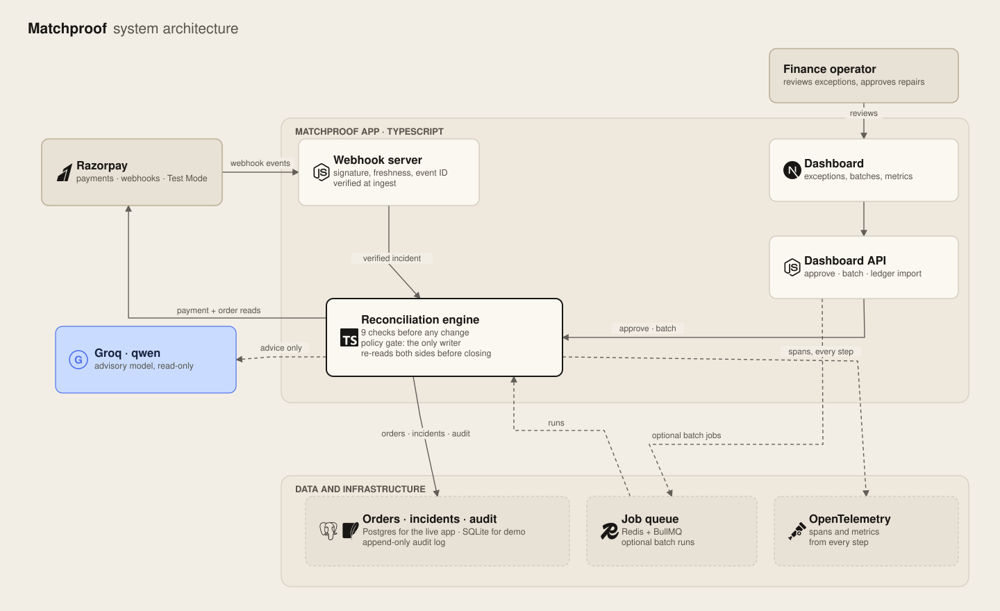
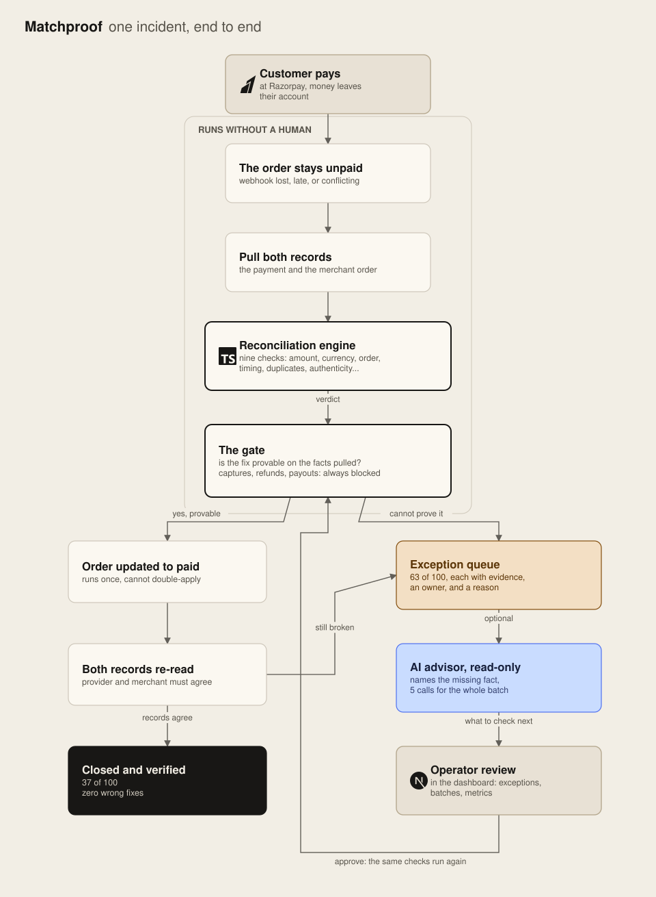

# Matchproof

Matchproof fixes a problem every Razorpay merchant runs into: a payment captures, but the merchant order stays pending. We built our own reconciliation algorithm: it checks nine things about a payment before it touches an order. On 100 synthetic test records it closed 37 end to end with zero wrong fixes, and kept the other 63 in a review queue with the evidence and a reason attached to each.

Built for the AI Finance Controller track: run one finance-operations loop over a batch of records, report the match rate, and keep every unresolved exception visible.

## Run the demo

```bash
pnpm install && pnpm demo
```

Runs one incident from the test set end to end: a payment that timed out after the order record changed. You see the evidence pulled, all nine checks run, the decision, the repair, and the re-check that closes it. No keys, no services, no database.

## The system

<p align="center"></p>

The AI advisor can read and suggest; the fixed rules inside our algorithm are the only thing that can write.

## One incident, end to end

<p align="center"></p>

The numbers on the diagram come from a labeled test set: 120 synthetic incidents across eight failure templates, 20 used while building the system and 100 held back for scoring. The AI's five calls go to the 63 hard rows, not the 37 easy ones.

## Results

| | Rule-based | With AI |
| --- | ---: | ---: |
| **Closed automatically, verified** | **37 / 100** | **37 / 100** |
| Exceptions kept for review | 63 | 63 |
| **Wrong fixes** | **0** | **0** |
| Match accuracy on rows it could match | 100% | 100% |
| Unsafe writes | 0 | 0 |
| Speed | 16.3 rows/s | 1.4 rows/s |
| Model calls for the batch | 0 | 5 |

The dataset is synthetic, so these scores describe generated incidents, not production traffic. Reproduce the run with `pnpm evaluate:baseline` and `pnpm evaluate:full`; raw output lands in `evaluation/baseline.json` and `evaluation/full-evaluation.json`.

## The 63 that stay open

The 37 closures are the rows where Razorpay's API settles the question: a late authorization, a paid-then-pending order, a capture timeout. The 63 below are rows where the deciding fact is not in the provider's API at all.

| Exception (count) | The fact no code can invent |
| --- | --- |
| `callback_missing_webhook_recovers` (13) | Whether the merchant's backend already applied the payment another way. That state lives inside the merchant's system, unreadable by design. |
| `webhook_delivery_failure` (13) | Whether the merchant processed the payment anyway. Provider data cannot reveal what the merchant already knows. |
| `settlement_exception` (13) | Whether the settlement event was never sent, lost, or still queued. The API will not say, and closing the order would assume money that may not have settled. |
| `paid_missing` (12) | Whether the order was updated locally through another flow. Same unreadable merchant-side state. |
| `one_payment_two_orders` (12) | Which of the two orders owns the money. That is a merchant business decision, not an API fact. |

Every exception stays in the queue with its evidence, a named owner, and why it stopped. Handing those rows to a human is what makes the 37 closures safe to trust. The AI tier helps here: five model calls cover the whole batch, and the summary it writes for each exception tells the operator what is missing and what to check next.

## Safety

- The system acts only on evidence verified as coming from Razorpay, signed so nothing forged gets in.
- The only write it can make is aligning the merchant order to verified payment state. Captures, refunds, payouts, fulfilment, and arbitrary writes are blocked and audited.
- The AI tier is read-only. It suggests; the rule set decides.
- Every repair runs under an idempotency key, so a lost acknowledgement cannot apply it twice, and both records are re-read before anything closes.
- Everything lands in an audit log nobody can rewrite. Six adversarial tests pass: prompt injection, unsupported tool calls, stale data, contradictory results after a fix, replay, duplicate webhooks.

## Quick start

Requires Node 22.13+, pnpm 11, Docker.

```bash
cp .env.example .env
docker compose up --build        # dashboard on http://localhost:3101
```

Local dashboard on `http://localhost:3000`:

```bash
docker compose up -d postgres redis
pnpm install && pnpm db:migrate && pnpm build
pnpm --dir apps/web start
```

To watch it work against real Razorpay Test Mode: start `pnpm razorpay:webhook-server` (port 9999), expose it with `ngrok http 9999`, point a Test Mode webhook at `https://.../webhooks/razorpay` in the Razorpay dashboard, then make a test payment and watch the incident reconcile. `pnpm razorpay:verify` checks your credentials against the API first.

All configuration lives in `.env.example` with comments and links for every key.

## Built with

[Razorpay](https://razorpay.com) (payments, webhooks) · [Groq](https://groq.com) (qwen, advisory) · TypeScript · [Next.js](https://nextjs.org) · [Drizzle ORM](https://orm.drizzle.team) · Postgres · SQLite · Redis with BullMQ · OpenTelemetry · Vitest

## Layout

```
src/incident_commander/   our algorithm: webhook, evidence, reconciliation, policy, recovery, verification
src/evaluation/           dataset and evaluation runners
src/db/                   schemas and Postgres/SQLite repositories
apps/web/                 dashboard: exceptions, batches, metrics, review workbench
tests/                    unit, red-team, integration, live Razorpay E2E
fixtures/                 synthetic incident fixtures
```

Unit suites cover every stage of the algorithm. `tests/red-team.test.ts` and `tests/security-hardening.test.ts` attack it with forged signatures, cross-tenant leakage, stale evidence, prompt injection, and replay after closure. `pnpm verify` runs typecheck, lint, format, and the unit suite in one command.
