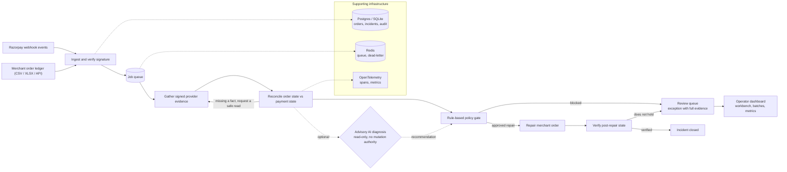

# Matchproof

Automates reconciliation for payments that captured at Razorpay but left the merchant order unpaid.

When a customer pays and Razorpay captures the payment, the merchant order is supposed to move to paid. It often does not: the webhook is missed or late, the authorization times out after the money moved, a settlement exception trips, or one payment ends up mapped to two orders. Someone in finance operations reconciles that by hand. Matchproof closes the loop: it ingests the merchant order ledger and Razorpay webhook events, reconciles every order against provider payment state, gathers signed provider evidence, applies a rule-based policy gate, executes the safe repair, and verifies the result before closing. On a held-out evaluation of 100 labeled records it closed 37 automatically with 100% exact-match accuracy on matchable rows and zero false matches, and preserved the remaining 63 as exceptions with evidence, an owner, and a stopping reason.

## The problem

Payments drift from orders. A payment captures, the money leaves the customer's account, and the merchant order stays `pending` because the event that would have marked it paid never arrived, arrived after an authorization window closed, or conflicted with another order. The merchant's order book and the payment provider's ledger no longer agree.

That lands in finance operations as a manual job: export the order ledger, pull payment records, match rows in a spreadsheet, file a support ticket for the rows that do not line up. Missed webhooks are exactly the rows that fall out of that process. Matchproof runs the reconciliation as a closed loop over every payment-to-order discrepancy and keeps the rows it cannot safely close in a review queue with the evidence attached.

## How it works

The pipeline runs each payment-to-order discrepancy through a closed loop: gather, reconcile, diagnose, gate, execute, observe, verify.

1. **Ingest.** `src/incident_commander/webhook.ts` verifies the Razorpay webhook signature, event freshness, and event ID before the event touches the store. `src/incident_commander/ledger-import.ts` parses the merchant order ledger (CSV or XLSX), validates every row, and upserts it idempotently.
2. **Queue.** `src/queue.ts` moves each event onto a BullMQ queue backed by Redis, with exponential backoff and a dead-letter queue.
3. **Gather evidence.** `src/incident_commander/evidence-gatherer.ts` reads the authoritative payment and order state from the Razorpay API, bounded by timeouts. `src/incident_commander/signatures.ts` signs the processed webhook payload with an HMAC so the evidence the loop acts on is unforgeable.
4. **Reconcile.** `src/incident_commander/reconciliation.ts` compares order state against provider payment state and checks a fixed set of invariants: identity, amount, currency, order mapping, chronology, freshness, uniqueness, idempotency, and authenticity. It returns an agreed state, a safe repair target, or a discrepancy with the reasons. If a fact is missing, it requests a safe read and the loop gathers more evidence.
5. **Diagnose.** The optional AI tier (`src/incident_commander/diagnosis.ts`, Groq qwen) sits between reconciliation and the policy gate. It sees the evidence timeline and names the missing fact and the next safe read. It has no mutation authority; its output is a recommendation the gate can ignore.
6. **Gate.** `src/incident_commander/policy.ts` is a rule-based policy gate. It authorizes only `reconcile_internal_state` (aligning the merchant order to verified provider state) and safe reads. Capture, refund, payout, fulfilment, and arbitrary writes are always blocked and audited.
7. **Execute.** `src/incident_commander/recovery-executor.ts` applies the approved repair through a merchant platform adapter under an idempotency key, so a lost acknowledgement cannot double-apply.
8. **Verify.** `src/incident_commander/post-repair-state-verifier.ts` re-reads provider and merchant state after the repair and closes the incident only when both sides agree. Anything else goes to the review queue.
9. **Review queue.** The dashboard (`apps/web`) lists every exception with its incident class, evidence, policy decision, and stopping reason, and routes unresolved rows through batches, metrics, and the review workbench.

## Architecture



The rule-based path is always present. The AI diagnosis is an optional branch into the same policy gate; it can suggest a read or name a missing fact, but it never authorizes an action.

## Measured results

Evaluation on 100 held-out labeled records (synthetic, 8 incident templates, 20/100 train/held-out split).

| Metric | Baseline | AI-assisted |
|---|---|---|
| Verified closures (fully automated) | 37 / 100 | 37 / 100 |
| Exceptions preserved | 63 | 63 |
| Exact-match accuracy on matchable rows | 100% | 100% |
| False-match rate | 0 | 0 |
| Incident classification accuracy | 100% | 100% |
| Unsafe side effects | 0 | 0 |
| Throughput (wall clock) | ~16 records/s | ~1.4 records/s |
| Model calls for the batch | 0 | 5 |

The AI tier is not faster and does not close more rows. It spends its calls on the 63 unresolved rows, not the 37 easy ones: the whole 100-record batch was served by 5 model calls because cluster investigations were replayed across 58 rows. It produces a complete operator packet for every residual row and always lands on the same verified closures and the same 63 exceptions as the rule-based path.

The dataset is synthetic and labeled: 120 records generated across 8 incident templates, split into 20 train and 100 held-out rows by scenario family, each with a ground-truth match label (matched, unmatched, abstained). All numbers above are the 100 held-out rows. The 6 formal safety scenarios all pass. Raw run data lives in `evaluation/baseline.json` and `evaluation/full-evaluation.json`.

## Safety model

- **Signed evidence.** Razorpay webhooks are verified against the webhook secret, and the processed evidence is HMAC-signed so the loop acts only on authenticated provider state (`signatures.ts`, `webhook.ts`).
- **Rule-based policy gate.** The only authority in the loop. It authorizes internal-state reconciliation and safe reads, and blocks capture, refund, payout, fulfilment, and arbitrary writes, each decision written to the audit log (`policy.ts`).
- **Advisory-only AI.** The model names missing facts and safe reads. Its output is schema-validated and checked against the canonical evidence set before the gate sees it. It cannot authorize a mutation.
- **Post-repair verification.** An incident closes only after provider and merchant state agree after the repair (`post-repair-state-verifier.ts`).
- **Audit records.** Every webhook, policy decision, recovery attempt, and verification is persisted to an append-only audit log.
- **Formal safety checks.** Six scenarios pass: prompt-injection containment, unsupported-tool denial, stale-observation hold, contradictory post-repair-state escalation, lost-acknowledgement replay without a second mutation, and duplicate-webhook suppression.

## What's honest about it

The 63 unresolved exceptions are the deliverable. A reconciliation tool that reports 100% closure is either solving an easier problem or hiding the rows it could not prove. Matchproof does neither: every unresolved exception stays in the review queue with its evidence, its policy decision, and its stopping reason, and each is routed to a named owner. The rule-based path abstains on rows where the invariants do not hold. That is the correct behavior for a system that writes to a merchant's financial records. Keeping the exceptions visible is what makes the 37 closures trustworthy.

## Quick start

Docker (dashboard on port 3101):

```bash
cp .env.example .env
docker compose up --build
```

Local:

```bash
pnpm install
docker compose up -d postgres redis
pnpm db:migrate
pnpm build
pnpm --dir apps/web start
```

The dashboard runs at `http://localhost:3000`. Environment variables (from `.env.example`):

- `GROQ_API_KEY`, `GROQ_MODEL` - optional AI diagnosis tier (default `qwen/qwen3.8-27b`)
- `PROCESSOR_WEBHOOK_SECRET` - signs processor webhook evidence
- `RAZORPAY_API_KEY`, `RAZORPAY_API_SECRET`, `RAZORPAY_WEBHOOK_SECRET` - Razorpay Test Mode credentials
- `REDIS_URL` - queue connection
- `DATABASE_URL` - Postgres connection
- `PORT` - webhook server port (default 9999)
- `API_TOKEN` - optional bearer token for API auth

## Try it

```bash
pnpm demo                    # run the timeout-after-mutation incident end to end
pnpm evaluate:baseline       # rule-based evaluation over the synthetic dataset
pnpm evaluate:full           # baseline + AI-assisted evaluation with safety checks
pnpm razorpay:webhook-server # local webhook inbox at /webhooks/razorpay
pnpm razorpay:verify         # check Test Mode credentials against the Razorpay API
```

Results land in `evaluation/baseline.json` and `evaluation/full-evaluation.json`, with the per-event audit trail in `evaluation/full-evaluation-audit.jsonl`. The demo runs against a fixture and needs no external services.

## Repository layout

```
src/incident_commander/   reconciliation, evidence, policy, recovery, verification
src/evaluation/           dataset and the baseline + full evaluation runners
src/db/                   Drizzle schema, Postgres and SQLite repositories
src/queue.ts              BullMQ queue and dead-letter infrastructure
apps/web/                 Next.js dashboard (incidents, batches, metrics, workbench)
evaluation/               raw evaluation data
fixtures/                 synthetic incident fixtures
tests/                    unit, red-team, integration, and live E2E suites
scripts/                  verify-local.sh, run-full-evaluation.sh
```

## Testing

- **Unit.** Reconciliation, policy, evidence gathering, recovery executor, post-repair verification, ledger import, webhook, queue, playbooks, closed-loop controller, and agent investigation.
- **Red-team and security.** `tests/red-team.test.ts` and `tests/security-hardening.test.ts` cover forged signatures, cross-tenant leakage, stale evidence, prompt-injection containment, over-broad mutation scopes, duplicate suppression, and replay after closure.
- **Integration.** `tests/postgres.test.ts`, `tests/closed-loop-controller.test.ts`, `tests/demo-flow.test.ts`, `tests/merchant-platform.test.ts`, and `tests/observability.test.ts`.
- **Live Razorpay E2E.** `tests/razorpay-live-e2e.test.ts` runs against Razorpay Test Mode with credentials in `.env` (`pnpm test:razorpay:e2e`).
- **One pass.** `pnpm verify` runs typecheck, lint, format, and the full unit suite (`scripts/verify-local.sh`).
